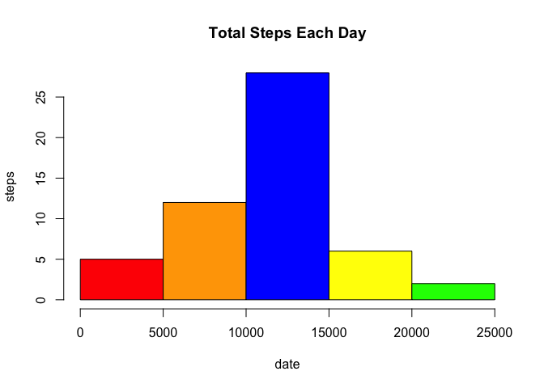
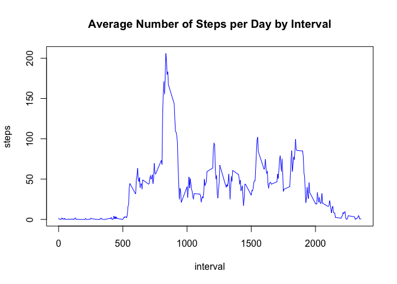
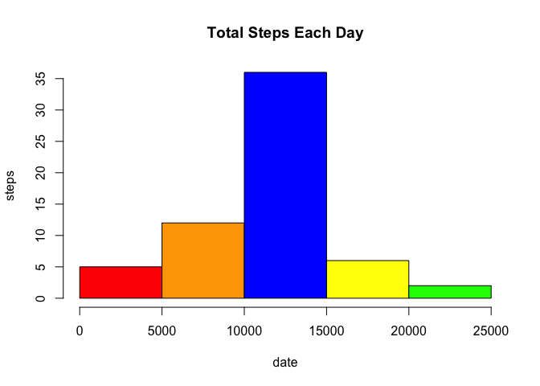
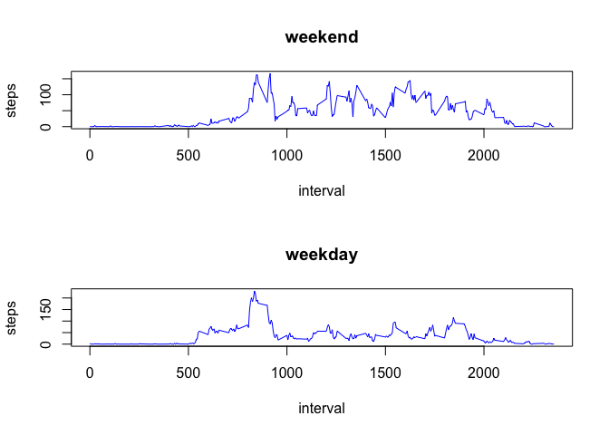

# Reproducible Research: Peer Assessment 1
Manuel Ramirez  
Sunday, Feb 07, 2016  


## Loading and preprocessing the data

1. Load the data (i.e. read.csv())


```r
setwd("/Users/manuelramirez/Coursera/datascience/Reproducible_Research/RepData_PeerAssessment1/")
if(file.exists("activity.zip")) {
    unzip("activity.zip")
}
activity <- read.csv("activity.csv")
```


## What is mean total number of steps taken per day?

1. Make a histogram of the total number of steps taken each day

2. Calculate and report the mean and median total number of steps taken per day


```r
steps.date <- aggregate(steps ~ date, data=activity, FUN=sum)
colours <- c("red", "orange", "blue", "yellow", "green")
hist(steps.date$steps, main="Total Steps Each Day", xlab="date", ylab="steps",col=colours)
```



```r
mean(steps.date$steps)
```

```
## [1] 10766.19
```

```r
median(steps.date$steps)
```

```
## [1] 10765
```


## What is the average daily activity pattern?

1. Make a time series plot (i.e. type = "l") of the 5-minute interval (x-axis) and the average number of steps taken, averaged across all days (y-axis)

2. Which 5-minute interval, on average across all the days in the dataset, contains the maximum number of steps?


```r
steps.interval <- aggregate(steps ~ interval, data=activity, FUN=mean)
plot(steps.interval, type="l", col="blue", main="Average Number of Steps per Day by Interval")
```



```r
steps.interval$interval[which.max(steps.interval$steps)]
```

```
## [1] 835
```


## Imputing missing values

1. Calculate and report the total number of missing values in the dataset (i.e. the total number of rows with NAs)

2. Devise a strategy for filling in all of the missing values in the dataset. The strategy does not need to be sophisticated. For example, you could use the mean/median for that day, or the mean for that 5-minute interval, etc.

3. Create a new dataset that is equal to the original dataset but with the missing data filled in.

4. Make a histogram of the total number of steps taken each day and Calculate and report the mean and median total number of steps taken per day. Do these values differ from the estimates from the first part of the assignment? What is the impact of imputing missing data on the estimates of the total daily number of steps?


```r
sum(is.na(activity))
```

```
## [1] 2304
```

```r
activity <- merge(activity, steps.interval, by="interval", suffixes=c("",".y"))
nas <- is.na(activity$steps)
activity$steps[nas] <- activity$steps.y[nas]
activity <- activity[,c(1:3)]

steps.date <- aggregate(steps ~ date, data=activity, FUN=sum)
colours <- c("red", "orange", "blue", "yellow", "green")
hist(steps.date$steps,  main="Total Steps Each Day",  xlab="date", ylab="steps",col=colours)
```



```r
mean(steps.date$steps)
```

```
## [1] 10766.19
```

```r
median(steps.date$steps)
```

```
## [1] 10766.19
```

## Are there differences in activity patterns between weekdays and weekends?

1. Create a new factor variable in the dataset with two levels – “weekday” and “weekend” indicating whether a given date is a weekday or weekend day.

2. Make a panel plot containing a time series plot (i.e. type = "l") of the 5-minute interval (x-axis) and the average number of steps taken, averaged across all weekday days or weekend days (y-axis). 


```r
day_type <- function(date) {
    if (weekdays(as.Date(date)) %in% c("Saturday", "Sunday")) {
        "weekend"
    } else {
        "weekday"
    }
}
activity$day_type <- as.factor(sapply(activity$date, day_type))

par(mfrow=c(2,1))
for (day in c("weekend", "weekday")) {
    steps_type <- aggregate(steps ~ interval,data=activity,subset=activity$day_type==day,FUN=mean)
    plot(steps_type, type="l", main=day, col="blue")
}
```


